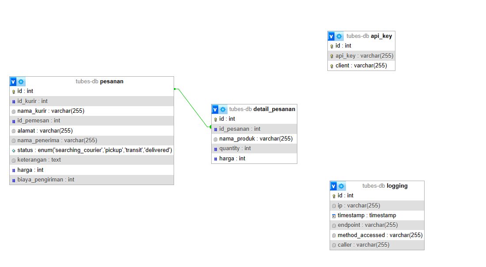

# Tugas Besar Milestone 2 IF3110 - _SOAP Service_

## Deskripsi _Web Service_
SOAP WebServices adalah service untuk mengelola pesanan yang dicheckout pada php agar dapat diolah pada aplikasi kurir

## Skema Basis Data

   
## _Endpoint API_
endpoint 1 : /pesanan 

List Method : 

getPesananByKurir(int id_kurir) 

getPesananByIdPesanan(int id_pesanan) 

getPesananNoKurir() 

addPesanan(int idPemesan, String alamat, String nama_penerima, String keterangan, String harga, int biaya_pengiriman, String nama_product, String quantity) 

ambilPesanan(int id_pesanan, int id_kurir, String nama_kurir) 

updatePesanan(int id_pesanan, int id_kurir, String status, String keterangan) \

getPesananByIdUser(int userId)

endpoint 2 : /detailPesanan

Method : getDetailPesanan(int id_pesanan)

## Pembagian Tugas

### Anggota Kelompok
**Kelompok 36**
| Nama                         | NIM      |
|------------------------------|----------|
| Ulung Adi Putra              | 13521122 |
| Naufal Baldemar Ardanni      | 13521154 |
| Dewana Gustavus Haraka Otang | 13521173 |

### SOAP

| Fungsionalitas                |           NIM                 |
|-------------------------------|-------------------------------|
| Setup                         | 13521173  |
| Pesanan  (semua services, repo, dll)                         | 13521122                           | 
| detailPesanan (semua services, repo, dll)                           | 13521122                           | 
| apiKey                             | 13521122                           | 
| logging (middleware, repo, dll)                  | 13521122                           | 
| database              | 13521122                           | 

### Bonus
| Fungsionalitas                |           NIM                 |
|-------------------------------|-------------------------------|
|Docker                         | 13521173                      |